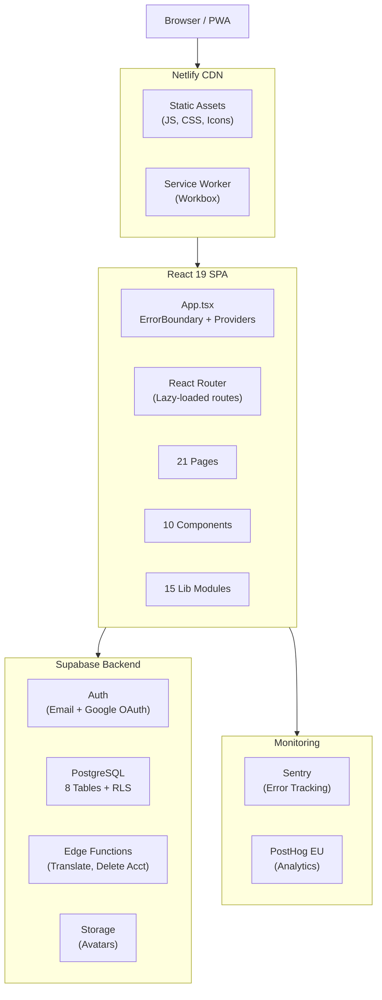
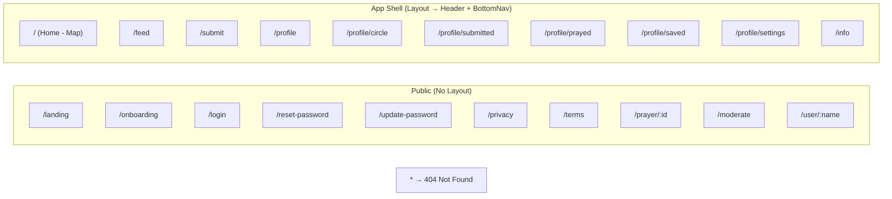
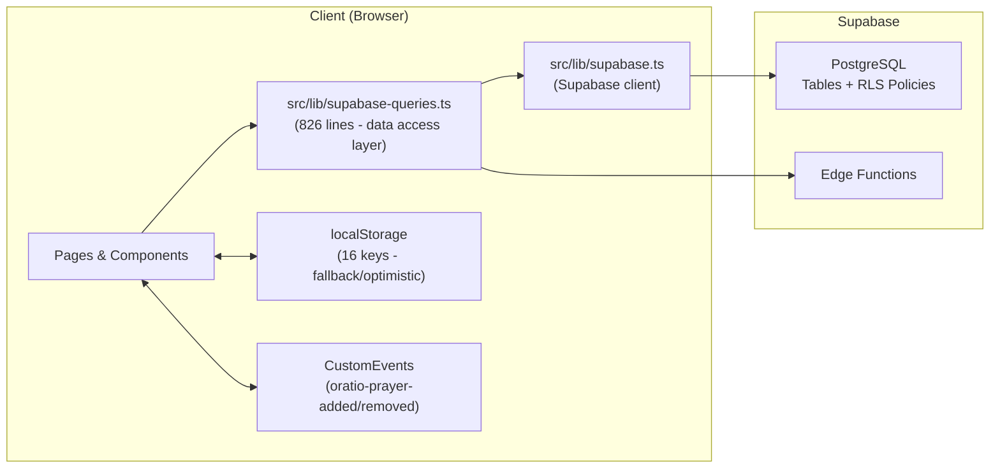
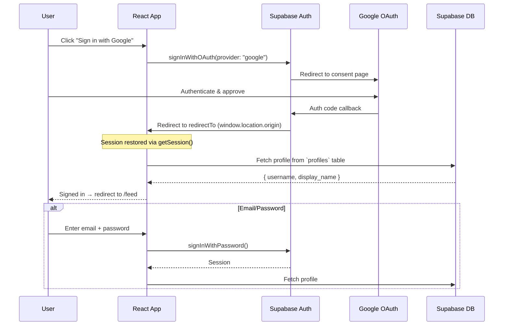
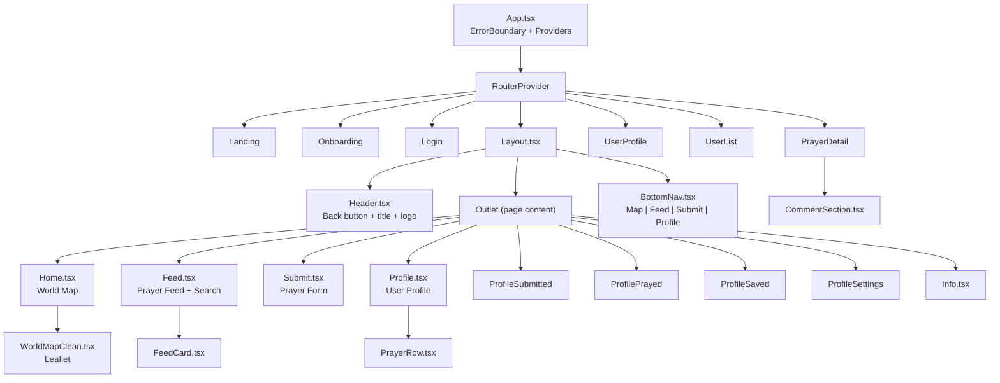
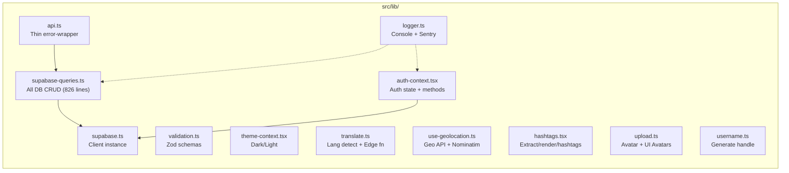
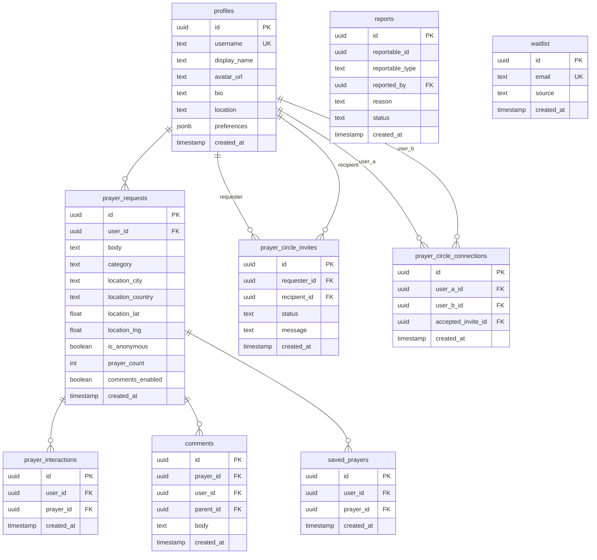
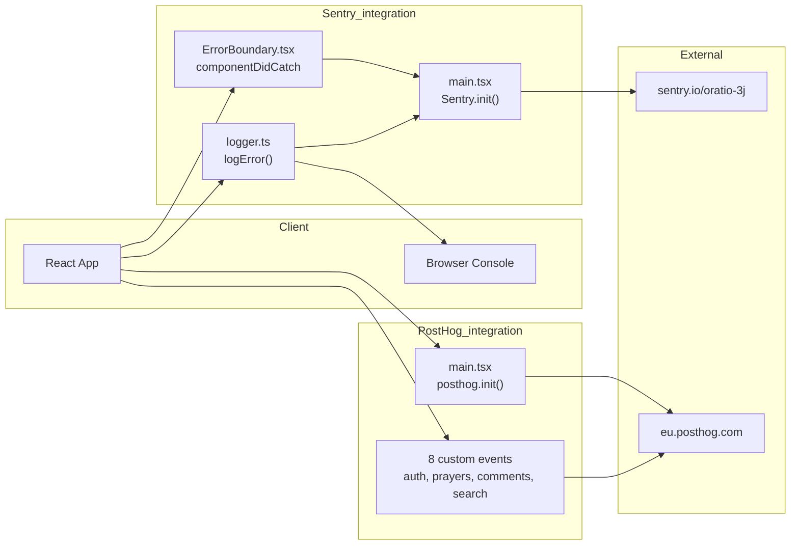

# Oratio Architecture

> Current state: **v1.0 Production Ready**
> Stack: React 19 + TypeScript + Vite + Supabase + Tailwind v4

---

## 1. High-Level Architecture



---

## 2. Route Tree



---

## 3. Data Flow



### Data Sources by Feature

| Feature | Primary Source | Fallback | Real-time |
|---------|---------------|----------|-----------|
| Prayer Feed | Supabase `prayer_requests` | — | Custom event |
| Submit Prayer | Supabase INSERT | localStorage | Dispatches event |
| Map Hotspots | Supabase `prayer_requests` | — | Custom event |
| Comments | Supabase `comments` | — | — |
| Prayer Circle | Supabase `prayer_circle_invites`, `prayer_circle_connections` | — | — |
| Reports | Supabase `reports` | localStorage | — |
| Saved Prayers | Supabase `saved_prayers` | localStorage | — |
| Profile | Supabase `profiles` | localStorage | — |
| Theme | localStorage | `prefers-color-scheme` | — |

---

## 4. Auth Flow



---

## 5. Component Tree



---

## 6. Library Modules



---

## 7. Database Schema (Supabase)



---

## 8. localStorage Keys

| Key | Purpose | Type |
|-----|---------|------|
| `oratio_prayed` | Prayer IDs user prayed for | `string[]` |
| `oratio_saved` | Saved prayer IDs | `string[]` |
| `oratio_submitted` | Submitted prayer IDs | `string[]` |
| `oratio_submitted_prayers` | Full submitted prayer objects | `PrayerRequest[]` |
| `oratio_reports` | Offline report fallback | `Report[]` |
| `oratio_profile` | Legacy profile data | `UserProfile` |
| `oratio_theme` | Dark/light preference | `"dark" \| "light"` |
| `oratio_location` | Cached geolocation | `sessionStorage` |
| `oratio_recent_searches` | Last 10 searches | `string[]` |
| `oratio_feed_visited` | Welcome tip dismissed | `boolean` |
| `oratio_last_prayer_location` | Last submit location | `object` |

---

## 9. Monitoring



### Captured Events
- `user_signed_up` / `user_signed_in` (email or Google)
- `prayer_submitted` (with city, country, anonymous flag)
- `prayer_prayed` / `prayer_unprayed`
- `prayer_saved` / `prayer_unsaved`
- `prayer_reported` (with reason)
- `comment_added` (with reply flag)
- `search_performed` (with query text)

---

## 10. Key Design Decisions

| Decision | Choice | Rationale |
|----------|--------|-----------|
| UI Library | Tailwind v4 + CSS vars | Zero runtime, custom theming, small bundle |
| Animations | `motion` (Framer Motion successor) | Spring physics, AnimatePresence, tree-shakeable |
| Routing | React Router v7 + `lazy()` | Full code splitting per route |
| Icons | `lucide-react` | Tree-shakeable, consistent style |
| Drawers | `vaul` | Mobile-native feel, touch-optimized |
| Map | Leaflet (canvas-rendered) | Free, no API key needed, lightweight |
| Forms | Native + Zod validation | No form library overhead |
| State | React hooks + localStorage | Minimal for current scale |
| Auth | Supabase Auth | Built-in OAuth, RLS integration |
| Translation | Supabase Edge Function | API key stays server-side |
| Error tracking | Sentry | Free tier, React integration |
| Analytics | PostHog (EU) | Open source, privacy-compliant |
| Deployment | Netlify | SPA-friendly, auto-deploy from git |
| Testing | Vitest + Testing Library | Fast, Vite-native, 50 tests |

---

## 11. File Map

```
src/
├── main.tsx                        # Entry — Sentry + PostHog init, render App
├── sw.ts                           # Service worker (Workbox precaching)
├── vite-env.d.ts                   # Env var type declarations
├── styles/
│   ├── tailwind.css                # Tailwind v4 entry
│   ├── theme.css                   # Design tokens (RGB vars, dark/light)
│   └── index.css                   # Animations, Leaflet imports
├── lib/
│   ├── supabase.ts                 # Supabase client (6 lines)
│   ├── auth-context.tsx            # Auth state + methods (130 lines)
│   ├── supabase-queries.ts         # All DB operations (826 lines)
│   ├── api.ts                      # Error wrapper (66 lines)
│   ├── validation.ts               # Zod schemas + sanitizer (117 lines)
│   ├── theme-context.tsx           # Dark/light theme (104 lines)
│   ├── logger.ts                   # Error logging (14 lines)
│   ├── translate.ts                # Language detection + Edge fn (77 lines)
│   ├── use-geolocation.ts          # Geo API hook (74 lines)
│   ├── hashtags.tsx                # Hashtag utilities (97 lines)
│   ├── upload.ts                   # Avatar handling (32 lines)
│   └── username.ts                 # Username generator (8 lines)
├── app/
│   ├── App.tsx                     # Root — providers + UpdatePrompt
│   ├── routes.tsx                  # Route definitions (21 routes)
│   ├── components/
│   │   ├── layout.tsx              # App shell (15 lines)
│   │   ├── header.tsx              # Top bar (80 lines)
│   │   ├── bottom-nav.tsx          # Tab bar (61 lines)
│   │   ├── feed-card.tsx           # Feed prayer card (120 lines)
│   │   ├── prayer-row.tsx          # Compact prayer row (156 lines)
│   │   ├── world-map-clean.tsx     # Leaflet map (282 lines)
│   │   ├── comment-section.tsx     # Threaded comments (297 lines)
│   │   ├── crisis-resources.tsx    # Helpline accordion (97 lines)
│   │   ├── error-boundary.tsx      # Error boundary (57 lines)
│   │   └── loading-spinner.tsx     # Spinner + error state (45 lines)
│   ├── pages/
│   │   ├── landing.tsx             # Marketing page (203 lines)
│   │   ├── onboarding.tsx          # Sign up (170 lines)
│   │   ├── login.tsx               # Sign in (128 lines)
│   │   ├── reset-password.tsx      # Reset request (133 lines)
│   │   ├── update-password.tsx     # New password (170 lines)
│   │   ├── home.tsx                # Map page (286 lines)
│   │   ├── feed.tsx                # Prayer feed (775 lines)
│   │   ├── submit.tsx              # Submit prayer (456 lines)
│   │   ├── profile.tsx             # User profile (463 lines)
│   │   ├── profile-submitted.tsx   # Submitted prayers (294 lines)
│   │   ├── profile-prayed.tsx      # Prayed-for prayers (196 lines)
│   │   ├── profile-saved.tsx       # Saved prayers (212 lines)
│   │   ├── profile-settings.tsx    # Settings (285 lines)
│   │   ├── prayer-detail.tsx       # Full prayer view (489 lines)
│   │   ├── user-profile.tsx        # Other user's profile (200 lines)
│   │   ├── prayer-circle.tsx       # Mutual Prayer Circle invites/connections
│   │   ├── moderate.tsx            # Moderation dashboard (136 lines)
│   │   ├── info.tsx                # Beta info (250 lines)
│   │   ├── terms.tsx               # Terms of service (63 lines)
│   │   ├── privacy.tsx             # Privacy policy (58 lines)
│   │   └── not-found.tsx           # 404 page (24 lines)
│   └── data/
│       ├── prayer-data.ts          # Prayer types, city DB, mock data (396 lines)
│       └── profile-data.ts         # Legacy localStorage profile (229 lines)
├── test/
│   ├── setup.ts
│   └── ... (test files co-located with source)
```

---

## 12. Supabase RLS Policies Summary

| Table | SELECT | INSERT | UPDATE | DELETE |
|-------|--------|--------|--------|--------|
| `profiles` | Everyone | — | Own row | — |
| `prayer_requests` | Everyone | Authenticated | Owner only | Owner only |
| `prayer_interactions` | Everyone | Own | — | Own |
| `comments` | Everyone | Authenticated | — | Own |
| `prayer_circle_invites` | Participants | Requester | RPC only | RPC only |
| `prayer_circle_connections` | Participants | RPC only | — | Participants |
| `saved_prayers` | Own | Own | — | Own |
| `reports` | Everyone | Authenticated | Mod Only | — |
| `waitlist` | — | Anyone | — | — |
